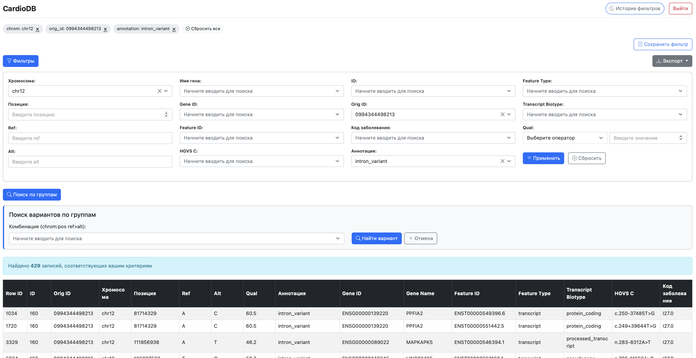

# Веб-приложение для мониторинга геномных мутаций 

Веб-приложение для систематизации и визуализации геномных данных пациентов.

## Оглавление

1.  [Введение](#введение)
2.  [Основные возможности](#основные-возможности)
3.  [Технологический стек](#технологический-стек)
4.  [Установка и запуск](#установка-и-запуск)
    *   [Требования](#требования)
    *   [Локальный запуск (для разработки)](#локальный-запуск-для-разработки)
5.  [Структура проекта](#структура-проекта)
6.  [Руководство пользователя (краткое)](#руководство-пользователя-краткое)
7.  [Тестирование](#тестирование)
8.  [Скрин](#скрин)
9.  [Авторы](#авторы)

## Введение

Веб-приложение "Мониторинг геномных мутаций" предназначено для упрощения работы с данными, получеными в результате геномного секвенирования. Оно предоставляет специалистам в области медицинской генетики, клиницистам и исследователям понятный интерфейс для анализа генетических вариантов, их фильтрации по различным параметрам и сохранения результатов для дальнейшего использования. 

## Основные возможности

*   **Табличное представление геномных данных:** Адаптивная таблица с постраничной навигацией, сортировкой и удобным отображением длинных значений.
*   **Многоуровневая фильтрация:**
    *   По категориальным признакам (хромосома, ген, аннотация, тип признака, код заболевания и др.) с использованием выпадающих списков с поиском.
    *   По числовым значениям (ID, позиция).
    *   Специальный фильтр по параметру качества (Qual) с выбором операторов сравнения (=, >, <, >=, <=).
*   **Поиск по группам:** Быстрый поиск по комбинации "хромосома:позиция референсный>альтернативный_аллель" с автоматическим заполнением полей основного фильтра.
*   **Управление историей фильтров:**
    *   Сохранение пользовательских наборов фильтров с возможностью их именования.
    *   Просмотр, применение и удаление сохраненных фильтров на отдельной странице.
*   **Экспорт данных:** Выгрузка отфильтрованных данных в форматы CSV и Excel.
*   **Пользовательская аутентификация:** Система входа и выхода для зарегистрированных пользователей.
*   **Безопасность и надежность:** Использование встроенных механизмов Django для защиты от веб-уязвимостей, базовая обработка ошибок.

## Технологический стек

*   **Бэкенд:**
    *   Python 3.12
    *   Django (веб-фреймворк)
    *   PostgreSQL (система управления базами данных)
*   **Фронтенд:**
    *   HTML5, CSS3, JavaScript
    *   Bootstrap 5 (для адаптивного дизайна и UI-компонентов)
    *   jQuery (для интерактивности)
    *   Select2 (для улучшенных выпадающих списков)
*   **Библиотеки для экспорта:**
    *   `csv` (встроенная в Python)
    *   `xlsxwriter` (для генерации Excel файлов)
*   **Развертывание:**
    *   Веб-сервер (CloudOps)
    *   [Перейти на сайт](http://185.195.27.132:8080/)

## Установка и запуск

### Требования

*   Python 3.8+
*   pip (менеджер пакетов Python)
*   Git
*   PostgreSQL (установленный и настроенный сервер)

### Локальный запуск 

1.  **Клонируйте репозиторий**
2.  **Создайте и активируйте виртуальное окружение:**
    ```bash
    python -m venv venv
    # Для Linux/macOS:
    source venv/bin/activate
    # Для Windows:
    # venv\Scripts\activate
    ```
3.  **Установите зависимости:**
    ```bash
    pip install -r requirements.txt
    ```
4.  **Настройте базу данных:**
    *   Создайте базу данных PostgreSQL.
    *   Укажите ваши учетные данные для БД или напрямую отредактируйте параметры `DATABASES` в файле `settings.py`.
5.  **Примените миграции:**
    ```bash
    python manage.py migrate
    ```
6.  **Создайте суперпользователя (администратора):**
    ```bash
    python manage.py createsuperuser
    ```
7.  **Запустите сервер разработки:**
    ```bash
    python manage.py runserver
    ```
    Приложение будет доступно по адресу `http://127.0.0.1:8000/`.


## Руководство пользователя (краткое)

1.  **Авторизация:** Войдите в систему, используя свои учетные данные.
2.  **Просмотр данных:** На главной странице отобразится таблица с геномными данными. Используйте пагинацию для навигации.
3.  **Фильтрация:**
    *   Нажмите кнопку "Фильтры" для открытия панели фильтров.
    *   Выберите или введите значения в соответствующие поля.
    *   Нажмите "Применить".
    *   Для сброса используйте кнопку "Сбросить".
4.  **Поиск по вариантам:**
    *   Нажмите кнопку "Поиск по группам" (стоит переименовать для ясности, например, "Поиск по варианту").
    *   Выберите комбинацию "хромосома:позиция ref>alt" из выпадающего списка.
    *   Нажмите "Найти вариант". Поля основного фильтра автоматически заполнятся.
5.  **Сохранение фильтров:**
    *   После применения нужных фильтров, нажмите кнопку "Сохранить текущие фильтры".
    *   Введите название для фильтра и нажмите "Сохранить" в модальном окне.
6.  **История фильтров:**
    *   Перейдите на страницу "История фильтров" через ссылку в шапке.
    *   Просматривайте, применяйте или удаляйте сохраненные фильтры.
7.  **Экспорт данных:**
    *   Примените необходимые фильтры.
    *   Нажмите кнопку "Экспорт" и выберите формат (CSV или Excel).
8.  **Выход из системы:** Нажмите кнопку "Выйти" в шапке сайта.

## Тестирование

Проект включает набор модульных и интеграционных тестов для проверки корректности работы моделей, форм и представлений. Для запуска тестов выполните команду:

```bash
python manage.py test
# или для конкретных приложений:
# python manage.py test genomic_app
# python manage.py test user
```

## Скрин основного экрана

## Авторы

*   Самилык Анастасия


